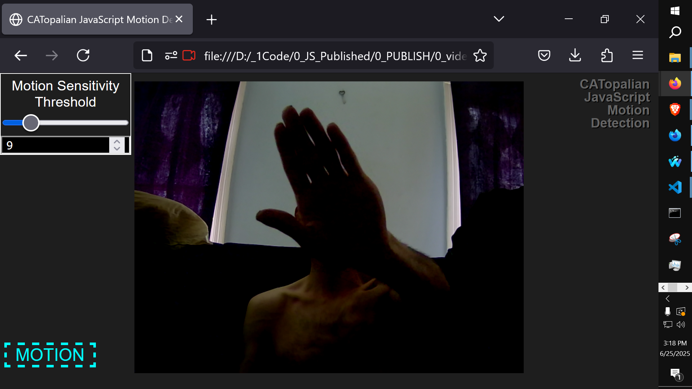
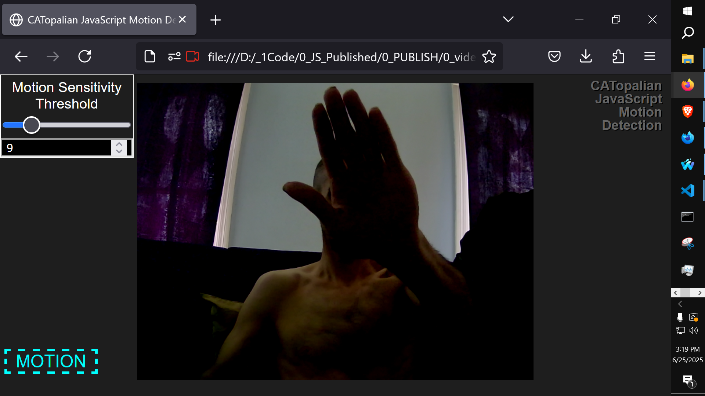

# CATopalian JavaScript Motion Detection
A JavaScript Camera Application that detects any motion using Canvas, which is highly efficient.  

Use App: https://christopherandrewtopalian.github.io/CATopalian_JavaScript_Motion_Detection/CATopalian_JavaScript_Motion_Detection.html

[Video](https://www.youtube.com/watch?v=kbJceT7zfHg)

---

### How to Download this App
1. Click the green Code Button on this github page
2. Choose Download ZIP
3. Save the Zip File
4. Extract All
5. Double click the HTML file to start the App

---

Happy Scripting :-)

